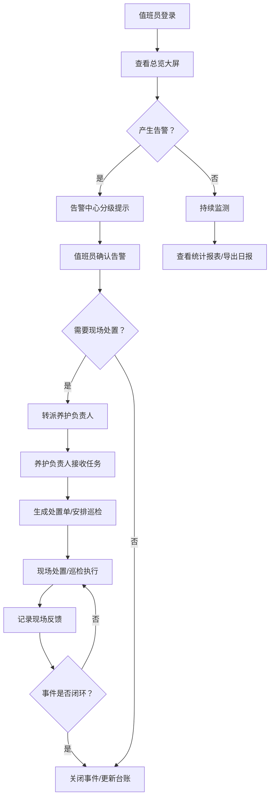

## 1. 产品概述

隧道监控管理Web应用，面向高速公路隧道运营场景，为监控中心值班员和养护负责人提供一站式运行状态监测、告警处置、设备管理与数据分析平台。系统通过实时数据采集与可视化呈现，实现隧道全生命周期运维管控，保障通行安全与运营效率。

## 2. 核心功能

### 2.1 用户角色

| 角色 | 注册方式 | 核心权限 |
|------|---------|---------|
| 监控中心值班员 | 管理员分配账号 | 查看大屏/视频墙、接收告警、确认转派告警、生成处置单、查看报表 |
| 养护负责人 | 管理员分配账号 | 接收转派任务、记录现场反馈、安排巡检、登记设备检修、追踪未关闭事件 |

### 2.2 功能模块

1. **总览大屏**：隧道拓扑图、实时车流、设备运行总览、环境监测、实时告警
2. **视频墙**：多路摄像头画面轮巡、单屏放大、分组切换、云台控制
3. **告警中心**：告警分级列表、告警确认、告警转派、告警详情、历史告警查询
4. **设备台账**：设备清单、设备状态、设备检修记录、设备详情
5. **巡检任务**：巡检路线安排、巡检任务派发、巡检记录、异常上报
6. **事件处置**：处置单生成、处置进度跟踪、现场反馈记录、未关闭事件追踪
7. **统计报表**：历史趋势、按时段/隧道筛选、日报导出、告警统计、设备运行统计

### 2.3 页面详情

| 页面名称 | 模块名称 | 功能描述 |
|---------|---------|---------|
| 总览大屏 | 隧道拓扑图 | 展示隧道布局、各子系统点位分布，颜色区分设备状态 |
| 总览大屏 | 车流监测 | 实时车流量、平均车速、车道占用率，趋势迷你图 |
| 总览大屏 | 设备总览 | 照明/风机/水泵/消防/环境传感器各类设备运行数量统计、故障数量 |
| 总览大屏 | 环境监测 | CO浓度、能见度、温湿度、风速风向实时数据及阈值告警提示 |
| 总览大屏 | 实时告警 | 滚动展示最新告警，按等级着色，点击跳转详情 |
| 总览大屏 | 筛选控件 | 隧道选择、时段切换（今日/本周/本月） |
| 视频墙 | 视频网格 | 2×2/3×3/4×4多画面布局切换 |
| 视频墙 | 画面操作 | 单屏双击放大、截图、云台方向控制、焦距调节 |
| 视频墙 | 分组切换 | 按隧道区域、摄像头类型快速切换分组 |
| 告警中心 | 告警列表 | 告警时间、等级（紧急/重要/一般/提示）、来源设备、告警内容、当前状态 |
| 告警中心 | 告警操作 | 单条/批量确认告警、填写确认说明、转派至养护人员 |
| 告警中心 | 告警筛选 | 按等级、状态、设备类型、时间范围、隧道组合筛选 |
| 告警中心 | 告警详情 | 告警完整信息、关联设备、历史同类告警、处置记录时间线 |
| 设备台账 | 设备列表 | 设备编号、名称、类型、安装位置、运行状态、最近检修时间 |
| 设备台账 | 设备搜索 | 关键字搜索、多条件高级筛选 |
| 设备台账 | 设备详情 | 基本信息、实时参数、运行历史、检修记录时间线 |
| 设备台账 | 检修登记 | 新增检修记录：检修类型、检修人员、问题描述、处理结果 |
| 巡检任务 | 路线管理 | 创建/编辑巡检路线，关联检查点和检查项 |
| 巡检任务 | 任务派发 | 生成巡检任务，指派巡检人员和执行时段 |
| 巡检任务 | 巡检记录 | 查看巡检完成情况，异常项高亮，支持异常转告警 |
| 事件处置 | 处置单列表 | 处置单编号、关联告警、处置状态、负责人、剩余时限 |
| 事件处置 | 生成处置单 | 从告警创建处置单，填写处置方案、指派人员、设置时限 |
| 事件处置 | 进度跟踪 | 处置阶段进度条、现场反馈图文记录、状态流转时间轴 |
| 事件处置 | 未关闭追踪 | 独立Tab展示所有未闭环事件，超时事件醒目标记 |
| 统计报表 | 历史趋势 | 车流/环境/告警多维度折线/柱状趋势图 |
| 统计报表 | 筛选条件 | 隧道多选、日期范围、指标选择 |
| 统计报表 | 日报导出 | 生成当日运营日报PDF/Excel下载 |
| 统计报表 | 告警统计 | 各等级告警占比饼图、Top告警设备排行 |
| 统计报表 | 设备运行统计 | 各类型设备在线率、故障率、MTBF指标卡片 |

## 3. 核心流程

值班员登录系统后，通过总览大屏掌握全局运行态势。当告警产生时，系统在告警中心分级推送，值班员确认告警并视情况转派养护负责人。养护负责人接收转派后生成处置单，安排巡检或现场处置，记录反馈信息直至事件闭环。管理人员可通过统计报表查看历史数据、导出日报、分析运行趋势。

## 4. 用户界面设计

### 4.1 设计风格

- **主色调**：深空蓝 #0A1628（背景基调）、科技青 #00D4FF（强调色）、告警橙 #FF7A00、告警红 #FF3B3B、正常绿 #00C853
- **辅助色**：深灰蓝 #1A2942（卡片背景）、描边蓝 #2A4063
- **按钮风格**：扁平化 + 渐变描边，圆角4px，告警类按钮使用脉冲呼吸动画
- **字体**：数字字体选用 **JetBrains Mono**（营造工业仪表感），正文选用 **Noto Sans SC**，大标题选用 **Orbitron**（科技感展示字体）
- **布局风格**：顶部导航栏 + 左侧菜单 + 内容区三栏结构；大屏页面采用全屏沉浸式无菜单布局，深色仪表盘风格
- **图标风格**：统一使用线性SVG图标，告警图标带闪烁动画，数据指标使用发光辉光效果
- **背景**：深空蓝渐变底色 + 极细网格纹理 + 微弱扫描线动画，营造监控中心科技氛围

### 4.2 页面设计概要

| 页面名称 | 模块名称 | UI元素 |
|---------|---------|---------|
| 总览大屏 | 隧道拓扑图 | 全屏SVG隧道示意图，设备点位悬浮显示实时数据，故障点位红色脉冲闪烁 |
| 总览大屏 | 数据卡片 | 圆角深色卡片 + 发光数值 + 迷你趋势折线，指标异常时边框变红 + 微动效 |
| 视频墙 | 视频网格 | 黑边视频窗口 + 顶部角标（摄像头名/状态） + 底部控制条悬浮，悬停放大效果 |
| 告警中心 | 告警列表 | 按行着色（紧急红底/重要橙底/一般黄底/提示灰底），新告警滑入动画 |
| 设备台账 | 状态标签 | 圆形色点 + 文字标签（运行绿/离线灰/故障红/维保蓝） |
| 事件处置 | 进度时间轴 | 竖向时间轴，节点圆形图标，当前阶段发光高亮 |
| 统计报表 | 图表区 | ECharts深色主题图表，数据渐变填充，图例悬停联动 |

### 4.3 响应式

- 桌面端优先设计（1920×1080及以上），适配监控中心大屏显示器
- 平板端（≥1024px）保留核心功能，侧边栏可折叠
- 总览大屏页面支持全屏模式，F11/按钮触发
- 表格列支持横向滚动，移动端列表转为卡片堆叠展示

### 4.4 动效与微交互

- 告警图标：红色呼吸脉冲动画（scale 1→1.2 循环）
- 数据更新：数值变化时数字滚动过渡（0.6s ease-out）
- 页面切换：内容区淡入 + 轻微上移（24px）
- 卡片悬停：上移4px + 阴影加深 + 科技青描边淡入
- 大屏模式：侧边栏/顶栏滑出隐藏，内容区全屏铺开
