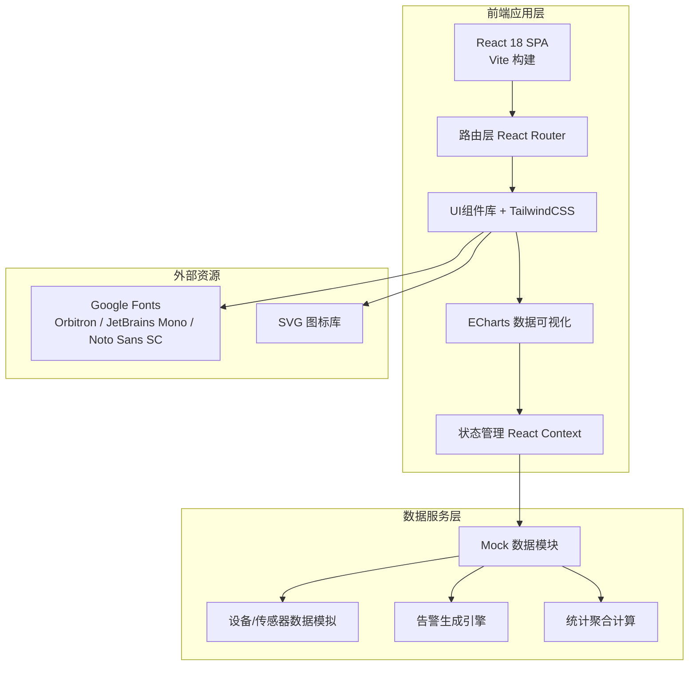

## 1. 架构设计



## 2. 技术描述

- **前端框架**：React@18 + TypeScript@5
- **构建工具**：Vite@5
- **样式方案**：TailwindCSS@3 + CSS Variables（主题系统）
- **路由**：React Router@6
- **数据可视化**：ECharts@5（深色主题配置）
- **状态管理**：React Context + useReducer（告警/设备全局状态）
- **日期处理**：date-fns
- **图标**：自定义SVG图标集（线性风格）
- **Mock数据**：内置TypeScript数据模块，模拟实时数据更新（setInterval）
- **UI交互**：framer-motion（页面切换/告警动画）

## 3. 路由定义

| 路由 | 页面 | 说明 |
|------|------|------|
| `/` | 总览大屏 | 首页，沉浸式全屏布局 |
| `/dashboard` | 总览大屏 | 与 `/` 别名 |
| `/video-wall` | 视频墙 | 多路摄像头画面 |
| `/alerts` | 告警中心 | 告警列表与详情抽屉 |
| `/devices` | 设备台账 | 设备列表 + 详情页 |
| `/devices/:id` | 设备详情 | 单设备参数与检修记录 |
| `/inspection` | 巡检任务 | 路线管理 + 任务派发 |
| `/incidents` | 事件处置 | 处置单列表 + 未关闭追踪 |
| `/reports` | 统计报表 | 趋势图 + 筛选 + 导出 |

## 4. 全局状态与数据模型（TypeScript定义）

```typescript
// 设备类型枚举
enum DeviceType {
  LIGHTING = 'lighting',
  FAN = 'fan',
  PUMP = 'pump',
  FIRE = 'fire',
  SENSOR = 'sensor',
  CAMERA = 'camera',
}

// 设备运行状态
enum DeviceStatus {
  RUNNING = 'running',    // 运行中
  OFFLINE = 'offline',    // 离线
  FAULT = 'fault',        // 故障
  MAINTENANCE = 'maintenance', // 维保中
}

// 告警等级
enum AlertLevel {
  URGENT = 'urgent',      // 紧急
  IMPORTANT = 'important', // 重要
  NORMAL = 'normal',      // 一般
  INFO = 'info',          // 提示
}

// 告警状态
enum AlertStatus {
  PENDING = 'pending',    // 待确认
  CONFIRMED = 'confirmed', // 已确认
  DISPATCHED = 'dispatched', // 已转派
  PROCESSING = 'processing', // 处置中
  CLOSED = 'closed',      // 已闭环
}

// 设备实体
interface Device {
  id: string;
  code: string;           // 设备编号
  name: string;
  type: DeviceType;
  tunnelId: string;
  location: string;       // 安装位置描述
  status: DeviceStatus;
  lastMaintenanceDate: string;
  params?: Record<string, number | string>; // 实时参数
  installedAt: string;
}

// 告警实体
interface Alert {
  id: string;
  deviceId: string;
  deviceName: string;
  level: AlertLevel;
  title: string;
  content: string;
  status: AlertStatus;
  createdAt: string;
  confirmedAt?: string;
  confirmedBy?: string;
  dispatchedTo?: string;
  closedAt?: string;
  relatedIncidentId?: string;
}

// 处置单实体
interface Incident {
  id: string;
  code: string;           // 处置单编号
  alertId?: string;
  title: string;
  description: string;
  assignee: string;       // 负责人
  deadline: string;       // 时限
  status: 'pending' | 'in_progress' | 'feedback' | 'closed';
  phase: number;          // 当前阶段 1-4
  createdAt: string;
  timeline: IncidentTimelineItem[];
  feedbacks: IncidentFeedback[];
}

interface IncidentTimelineItem {
  time: string;
  status: string;
  operator: string;
  remark?: string;
}

interface IncidentFeedback {
  id: string;
  time: string;
  reporter: string;
  content: string;
  images?: string[];
}

// 环境传感器数据
interface EnvironmentData {
  timestamp: string;
  tunnelId: string;
  co: number;             // CO浓度 ppm
  visibility: number;     // 能见度 m
  temperature: number;    // 温度 ℃
  humidity: number;       // 湿度 %
  windSpeed: number;      // 风速 m/s
  windDirection: string;  // 风向
}

// 车流数据
interface TrafficData {
  timestamp: string;
  tunnelId: string;
  flow: number;           // 车流量 辆/h
  avgSpeed: number;       // 平均车速 km/h
  occupancy: number;      // 车道占用率 %
  lane1Flow: number;
  lane2Flow: number;
  lane3Flow?: number;
}

// 巡检任务
interface InspectionTask {
  id: string;
  code: string;
  routeId: string;
  routeName: string;
  inspector: string;
  scheduledDate: string;
  timeSlot: string;       // 时段
  status: 'pending' | 'in_progress' | 'completed' | 'abnormal';
  checkPoints: InspectionCheckPoint[];
}

interface InspectionRoute {
  id: string;
  name: string;
  tunnelId: string;
  checkPoints: { name: string; items: string[] }[];
}

interface InspectionCheckPoint {
  name: string;
  items: { name: string; result: 'normal' | 'abnormal' | 'na'; remark?: string }[];
}
```

## 5. 目录结构设计

```
src/
├── assets/
│   ├── fonts/          # 字体文件（Orbitron等备用）
│   └── icons/          # SVG图标组件
├── components/
│   ├── layout/         # 布局组件（Sidebar, Header）
│   ├── common/         # 通用组件（Card, StatusBadge, DataNumber）
│   ├── charts/         # 图表组件（TrendChart, PieChart, Gauge）
│   ├── dashboard/      # 大屏专属组件（TunnelTopology, MiniTrend）
│   ├── alerts/         # 告警相关组件
│   ├── devices/        # 设备相关组件
│   └── incidents/      # 事件处置相关组件
├── context/            # React Context
│   ├── AlertContext.tsx
│   └── DeviceContext.tsx
├── data/               # Mock数据模块
│   ├── mockDevices.ts
│   ├── mockAlerts.ts
│   ├── mockEnvironment.ts
│   ├── mockTraffic.ts
│   └── mockIncidents.ts
├── pages/              # 路由页面
│   ├── Dashboard.tsx
│   ├── VideoWall.tsx
│   ├── Alerts.tsx
│   ├── Devices.tsx
│   ├── DeviceDetail.tsx
│   ├── Inspection.tsx
│   ├── Incidents.tsx
│   └── Reports.tsx
├── hooks/              # 自定义Hooks
│   ├── useRealtimeData.ts
│   └── useAlertPolling.ts
├── types/              # TypeScript类型定义
│   └── index.ts
├── utils/              # 工具函数
│   ├── format.ts       # 日期/数字格式化
│   └── colors.ts       # 主题色工具
├── App.tsx
├── main.tsx
└── index.css           # Tailwind + 全局样式 + 主题变量
```

## 6. 主题系统（CSS Variables）

在 `index.css` 中定义：

```css
:root {
  --bg-primary: #0A1628;
  --bg-secondary: #1A2942;
  --bg-card: #121F38;
  --border-color: #2A4063;
  --accent: #00D4FF;
  --accent-glow: rgba(0, 212, 255, 0.15);
  --success: #00C853;
  --warning: #FF7A00;
  --danger: #FF3B3B;
  --info: #FFD600;
  --text-primary: #EAF2FF;
  --text-secondary: #8FA4C7;
  --text-muted: #5A7298;
  --font-display: 'Orbitron', sans-serif;
  --font-number: 'JetBrains Mono', monospace;
  --font-body: 'Noto Sans SC', -apple-system, sans-serif;
}
```

## 7. 数据模拟策略

- 设备运行数据：每5秒随机波动，每30秒随机触发一次设备状态变更
- 告警生成：每45-90秒随机生成一条新告警，等级按权重（紧急5%/重要15%/一般50%/提示30%）
- 环境传感器：每3秒更新一组CO、温湿度、能见度数据，模拟正弦波动
- 车流数据：每10秒更新，模拟早高峰/晚高峰曲线
- 所有模拟数据保留最近24小时历史，用于趋势图展示
